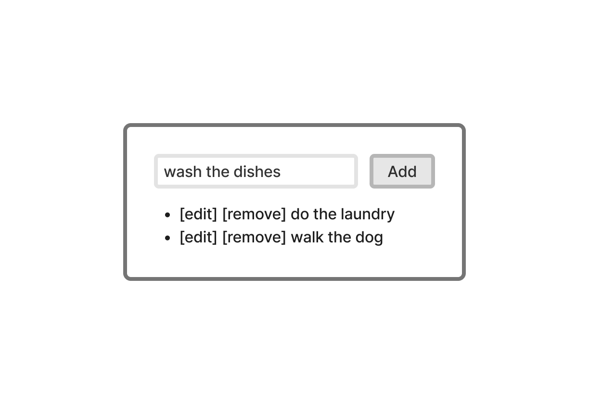

# Todo List

Video: <https://www.youtube.com/watch?v=GnBBTq4VXUM>

<a href="https://www.youtube.com/watch?v=GnBBTq4VXUM">
  
</a>

## Wireframe



## How to Run

Install dependencies:

```sh
npm install
```

Run the development server:

```sh
npm start
```
